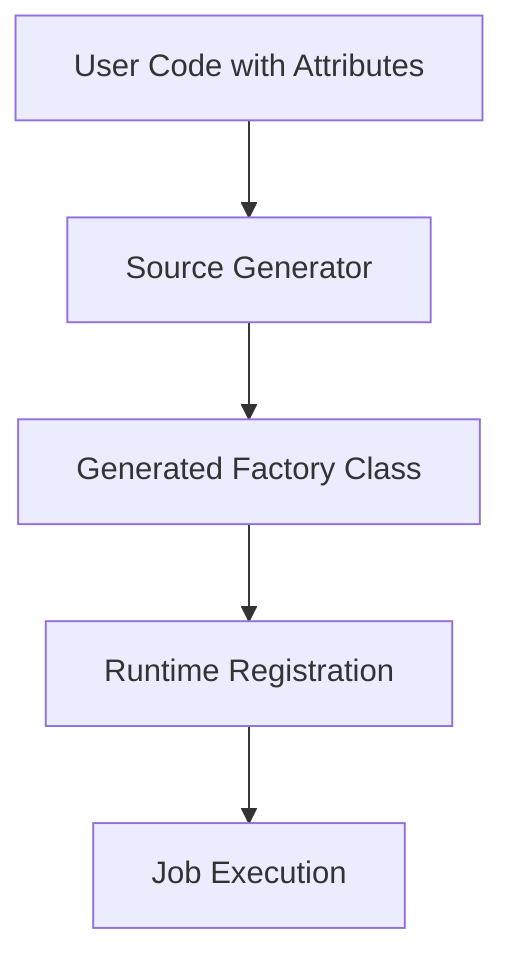
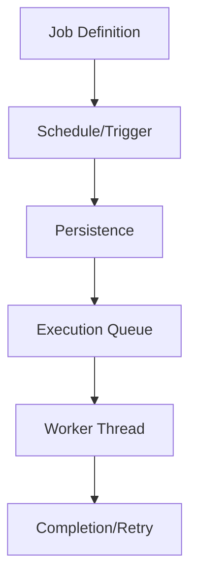

# AI Agent Guidelines for TickerQ

## Project Overview
TickerQ is a high-performance, reflection-free background task scheduler for .NET that emphasizes developer experience, reliability, and scalability. The project leverages source generators for compile-time optimizations and provides a comprehensive ecosystem for job scheduling and management.

## Core Values & Principles

### Performance First
- **Zero Reflection**: Use source generators for compile-time code generation
- **Memory Efficient**: Minimize allocations and optimize memory usage patterns  
- **Async/Await**: Proper async patterns throughout the codebase
- **Cancellation Support**: All operations should support `CancellationToken`

### Developer Experience
- **Simple API**: Easy-to-use attributes and fluent configuration
- **Rich Documentation**: Comprehensive docs with examples
- **Clear Error Messages**: Helpful diagnostics and validation
- **IDE Support**: Full IntelliSense and debugging support

### Reliability & Scalability
- **Stateless Design**: Core components are stateless for horizontal scaling
- **Error Handling**: Robust exception handling and retry mechanisms
- **Multi-node Support**: Distributed job coordination
- **Persistence**: Reliable job storage with EF Core

## Architecture Understanding

### Key Components
1. **TickerQ.Utilities**: Core models, interfaces, and base functionality
2. **TickerQ**: Main library with DI container integration and hosting
3. **TickerQ.SourceGenerator**: Compile-time code generation for performance
4. **TickerQ.EntityFrameworkCore**: Persistence layer with multiple DB support
5. **TickerQ.Dashboard**: Real-time web UI for job management

### Source Generation Pipeline


### Job Lifecycle


## Coding Standards

### C# Style
- Use modern C# features (records, pattern matching, using declarations)
- Primary constructors for dependency injection where appropriate
- Explicit typing for complex types, `var` for obvious assignments
- Null-forgiving operator (`!`) only when nullability is guaranteed
- Use `nameof()` for parameter names and reflection

### Async Patterns
```csharp
// Preferred pattern
public async Task<T> ProcessAsync<T>(T request, CancellationToken cancellationToken = default)
{
    // Implementation with proper cancellation support
    await someOperation.ExecuteAsync(cancellationToken);
    return result;
}
```

### Attribute Design
```csharp
// Clean attribute usage
[TickerFunction("ProcessOrders", "0 0 * * *", TickerTaskPriority.High)]
public async Task ProcessOrders(TickerFunctionContext<OrderRequest> context, CancellationToken cancellationToken)
{
    var orders = context.Request.Orders;
    await ProcessOrdersInternal(orders, cancellationToken);
}
```

### Dependency Injection
```csharp
// Service registration
services.AddTickerQ(options =>
{
    options.SetMaxConcurrency(Environment.ProcessorCount * 2);
    options.AddOperationalStore<AppDbContext>();
    options.AddDashboard();
});

// Service usage
public class OrderService(IOrderRepository repository, ILogger<OrderService> logger)
{
    // Implementation
}
```

## Common Patterns & Best Practices

### Job Definition Pattern
```csharp
public class OrderProcessingJobs(IOrderService orderService, INotificationService notifications)
{
    [TickerFunction("ProcessPendingOrders", "*/5 * * * *")]
    public async Task ProcessPendingOrders(TickerFunctionContext context, CancellationToken cancellationToken)
    {
        var pendingOrders = await orderService.GetPendingOrdersAsync(cancellationToken);
        
        foreach (var order in pendingOrders)
        {
            cancellationToken.ThrowIfCancellationRequested();
            await orderService.ProcessOrderAsync(order.Id, cancellationToken);
        }
        
        await notifications.NotifyProcessingCompleteAsync(pendingOrders.Count, cancellationToken);
    }
    
    [TickerFunction("SendOrderNotification")]
    public async Task SendOrderNotification(TickerFunctionContext<OrderNotificationRequest> context, CancellationToken cancellationToken)
    {
        var request = context.Request;
        await notifications.SendOrderUpdateAsync(request.OrderId, request.Status, cancellationToken);
    }
}
```

### Error Handling Pattern
```csharp
public class CustomExceptionHandler : ITickerExceptionHandler  
{
    private readonly ILogger<CustomExceptionHandler> _logger;
    
    public CustomExceptionHandler(ILogger<CustomExceptionHandler> logger)
    {
        _logger = logger;
    }
    
    public async Task HandleAsync(Exception exception, TickerFunctionContext context)
    {
        _logger.LogError(exception, "Job {JobId} failed: {Message}", 
            context.TickerId, exception.Message);
            
        // Custom recovery logic
        if (exception is TransientException)
        {
            // Will be retried automatically
            return;
        }
        
        // Handle permanent failures
        await NotifyAdministrators(exception, context);
    }
}
```

### Testing Patterns
```csharp
[Test]
public async Task ProcessPendingOrders_WithValidOrders_ProcessesSuccessfully()
{
    // Arrange
    var orders = CreateTestOrders(5);
    _orderService.Setup(x => x.GetPendingOrdersAsync(It.IsAny<CancellationToken>()))
              .ReturnsAsync(orders);
    
    var context = new TickerFunctionContext(Guid.NewGuid(), TickerType.Cron);
    var jobs = new OrderProcessingJobs(_orderService.Object, _notifications.Object);
    
    // Act
    await jobs.ProcessPendingOrders(context, CancellationToken.None);
    
    // Assert
    _orderService.Verify(x => x.ProcessOrderAsync(It.IsAny<int>(), It.IsAny<CancellationToken>()), 
                        Times.Exactly(5));
}
```

## AI Assistant Specific Guidelines

### When Helping with Code
1. **Understand Context**: Always consider the broader architecture and existing patterns
2. **Performance Impact**: Consider compile-time and runtime performance implications
3. **Breaking Changes**: Be cautious about changes that might break existing functionality
4. **Testing**: Suggest appropriate tests for new functionality
5. **Documentation**: Include XML docs for public APIs

### When Debugging Issues
1. **Source Generator Problems**: Check generated code in obj folder
2. **DI Issues**: Verify service registration and lifetimes
3. **Job Not Executing**: Check function names, cron expressions, and registration
4. **Performance Issues**: Profile memory usage and async patterns

### When Suggesting Improvements
1. **Incremental Changes**: Prefer small, focused improvements
2. **Backward Compatibility**: Maintain API compatibility where possible
3. **Configuration**: Use options pattern for new settings
4. **Logging**: Add structured logging for debugging

## Domain Knowledge

### Cron Expressions
- Standard 5-field format: `minute hour day month day-of-week`
- Special characters: `*` (any), `/` (step), `,` (list), `-` (range)
- Examples: `0 0 * * *` (daily at midnight), `*/15 * * * *` (every 15 minutes)

### Job Scheduling Concepts
- **Time Ticker**: One-time execution at specific datetime
- **Cron Ticker**: Recurring execution based on cron expression
- **Batch Jobs**: Related jobs that can have dependencies
- **Retry Logic**: Configurable retry intervals with exponential backoff

### Multi-tenancy Considerations
- Jobs can be isolated by tenant
- Connection strings and contexts can be tenant-specific
- Dashboard access can be tenant-scoped

## Troubleshooting Guide

### Common Issues
1. **Jobs Not Running**: Check function registration, service lifetimes, and cron expressions
2. **Build Errors**: Verify source generator compatibility with target framework
3. **Performance Problems**: Profile async operations and database queries
4. **Dashboard Not Loading**: Check authentication setup and static file serving

### Debugging Steps
1. Enable detailed logging in development
2. Check generated code in `obj/` folder
3. Verify service registration order
4. Test with simple scenarios first
5. Use integration tests for complex workflows

## Contributing Guidelines

### Pull Request Standards
- Clear, descriptive titles and descriptions
- Include tests for new functionality
- Update documentation as needed
- Follow existing code style and patterns
- Consider performance and backward compatibility

### Code Review Focus Areas
- Source generator correctness and performance
- Proper async/await usage and cancellation support
- Thread safety and concurrency concerns
- API design and developer experience
- Test coverage and quality

When working with TickerQ, always prioritize performance, reliability, and developer experience. The project's success depends on these core principles being maintained across all components.